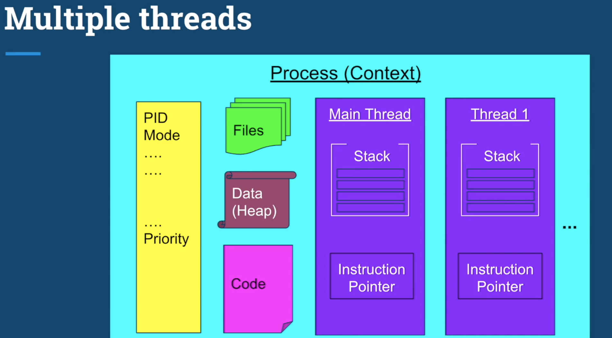
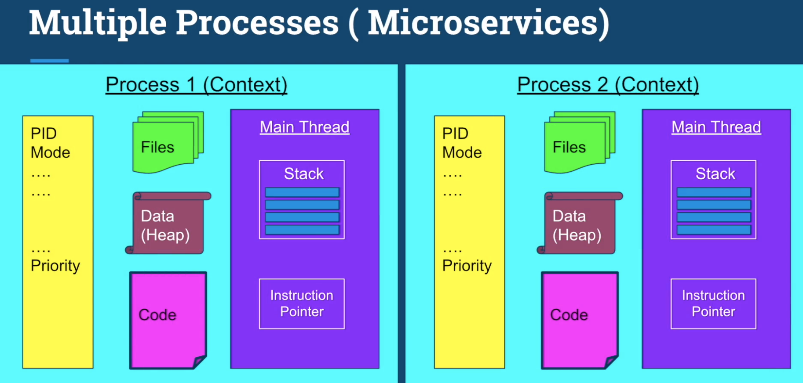

## Context Switch Key Points
1. Too many threads - **_Thrashing_** (Spends more time in management then real production work, 系統花太多時間在進程間switch, 使得多線程的好處降低)
2. Switching between threads is much cheaper than switching between process because many resource are shared.

## Thread Scheduling
1. First Come First Serve : sometimes cause starvation if a long process thread come first.
2. Shortest Job First: if small task keep coming, long thread may never have chance to be executed.
3. Time Slice:  each thread run a small amount of time.
   - Dynamic Prority: Determine how long of a slice for each thread
   - Dynamic Priority =  Static Prority + Bonus (+/-)
   - Static Prority is determined by developer
   - Bonus is adjusted by operating system in every epoch for each threads
   - OS will give preference for interactive thread (UI)
   - OS will give preference to thread that did not complete to prevent starvation

## Multi-Threads vs Multi-Processes
1. Threads shares many resouces while process doesnt, switch bewteen threads is cheaper
2. Threads are much fater to create, destroy and switch.
3. If task is unrelated, we should use MultiProcesses
4. If the security and stability is important, consider multiprocesses, because each is an independent task.

